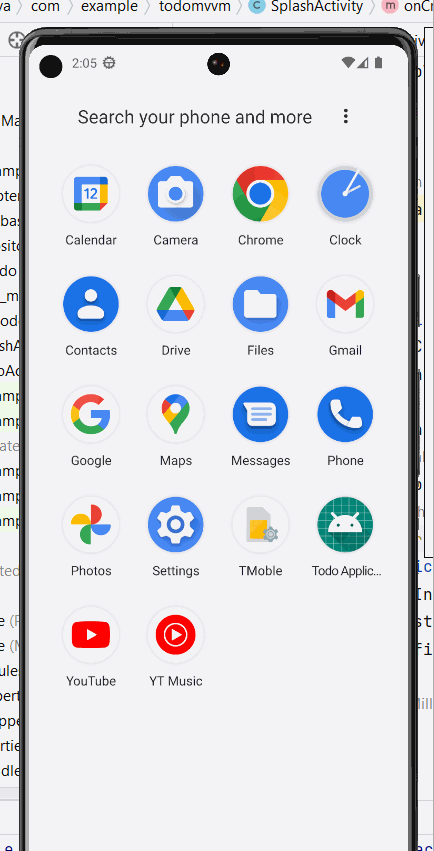
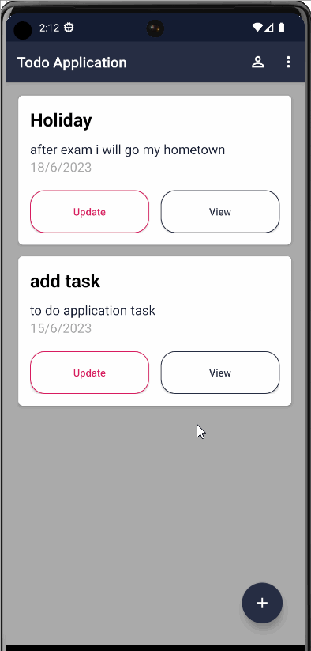

# 77261163_Avishekshah
# Todo-Application
A to-do app is a digital tool designed to help individuals and teams organize, prioritize, and manage their tasks and responsibilities. Whether you're juggling multiple projects, trying to keep track of daily errands, or simply looking for a better way to stay on top of your commitments, a to-do app can be an invaluable resource.With a to-do app, you can create and categorize tasks, set deadlines and reminders, and track your progress as you work towards completing your goals.
## Feature and Description
The TODO APP feature include:
## user friendly UI

## splash
This is splash screen of my to do app

## About_menu
This is about menu of to do app

## Add_Task
This is todo app where we add task

## Delect_Task
This is a delect task 

## View_Task
This is where we view task

## Share_Task
This is a where we share task with email or message

## Update_Task
This is a update task where we update task

## Basic Features

These are the basic functional requirements of our App that helps to do perform these mentioned features.

- Displaying Task List
- Adding Task
- Editing Task
- Deleting Task
- Marking Completed Task

## Additional Features

 These are the Non- functional requirements added on the Application to make it more real-world application.
 
- Launch Screen
- Application Icon
- Navigation Button
- Splash Screen 
- Delete Completed
- Task Share in Gmail
- Validation of TextView while adding new task and updating old task

## Author

- [Avishek Shah](https://github.com/avishekshah/Todo-Application.git/TodoMVVM.git)

## References
- [Binay Shah](https://github.com/binay-shah/TodoMVVM.git)

